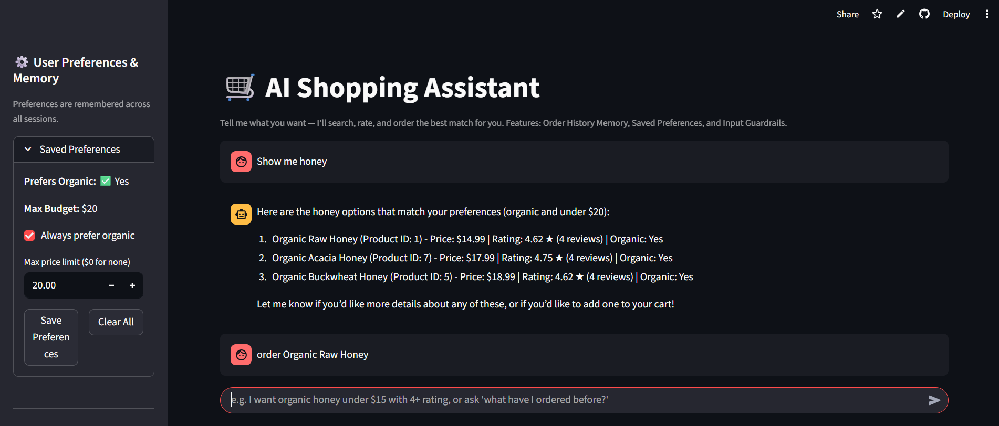

# 🛒 AI Shopping Assistant — Agentic AI with Memory, Guardrails & Vision

> An autonomous shopping agent built with LangChain, Groq, Streamlit and SQLite that searches products, verifies ratings, remembers user preferences, understands product photos, and completes purchases only after explicit confirmation — validated by automated evals (**6/6 tool-call accuracy, 98.3% response quality**).

🔗 **Live App:** [ai-shopping-assistant on Streamlit](https://ai-shopping-assistant-u3gynzky36n8s6psibn5l6.streamlit.app/)
📄 **Full Project Report:** [project_report.pdf](project_report.pdf)

---

## 📑 Table of Contents

- [Overview](#-overview)
- [Business Problem](#-business-problem)
- [Dataset](#-dataset)
- [Tools & Technologies](#-tools--technologies)
- [What Was Done](#-what-was-done)
- [App Preview](#-app-preview)
- [How to Run This Project](#-how-to-run-this-project)
- [Results & Conclusion](#-results--conclusion)
- [Future Work](#-future-work)
- [Author & Contact](#-author--contact)

---

## 🔎 Overview

This project is a production-style conversational e-commerce assistant. Instead of a single-turn chatbot, it works as an **agent**: it plans multi-step actions, calls typed tools, and returns answers in a fixed, readable format.

**What it can do:**
- Search products with filters (price, organic)
- Look up ratings and review counts before recommending
- Recognize a product from an uploaded photo ("Shop by Image")
- Remember preferences and past orders across sessions
- Place orders only after explicit user confirmation
- Politely decline off-topic requests (poems, weather, chit-chat)

---

## 🎯 Business Problem

Online shoppers waste time comparing products, checking ratings, and re-entering the same preferences every visit. Basic chatbots cannot combine these steps, and unguarded LLM agents can drift off-topic or trigger purchases by mistake.

**Goal:** build a reliable shopping agent that finds the right product, verifies quality, personalizes results, and stays safe around checkout.

---

## 🗂️ Dataset

| Item | Details |
| :--- | :--- |
| **Product catalog** | `store.db` — 32 grocery products (name, price, organic flag) |
| **Ratings** | `reviews_api.py` — average rating and review count per product |
| **Orders & preferences** | `orders.db` — `orders` and `user_preferences` tables |

---

## 🧰 Tools & Technologies

`Python` · `LangChain / LangGraph` · `Groq Cloud` · `openai/gpt-oss-120b` · `qwen/qwen3.8-27b (Vision)` · `Pydantic v2` · `SQLite` · `Streamlit` · `Git & GitHub`

---

## ⚙️ What Was Done

### 1. Autonomous Tool Calling
Seven strictly typed tools: `search_products`, `get_rating`, `checkout`, `describe_product_image`, `get_order_history`, `get_saved_preferences`, `set_saved_preference`.

### 2. Persistent Memory & Personalization
- Orders and preferences are stored in SQLite
- Saved preferences are injected into the system prompt at every turn
- Chat and sidebar controls stay in sync in real time

### 3. Guardrails & Safe Checkout
- `guardrails.py` classifies each input before the agent runs, so off-topic queries get an instant redirect and save API quota
- `checkout` needs explicit user confirmation before any order is created

### 4. Multimodal "Shop by Image"
An uploaded product photo is analyzed by a dedicated vision model, which extracts search parameters for the agent.

### 5. Automated Evaluation
- **Tool-call accuracy** (`eval_tool_calls.py`): 6 test cases checking the right tool and arguments
- **Response quality** (`eval_response_quality.py`): LLM-as-a-judge scoring relevance, correctness, and format

### 6. Key Engineering Challenges Solved
- Handled Groq's daily token limit by separating vision and agent models and adding retry backoff
- Fixed Streamlit sidebar state staleness using dynamic widget keys
- Isolated eval runs with `try...finally` backup/restore so tests never overwrite real preferences

---

## 🖼️ App Preview



---

## 🚀 How to Run This Project

**1. Clone the repository**
```bash
git clone https://github.com/Sahajahanur/ai-shopping-assistant.git
cd ai-shopping-assistant
```

**2. Install dependencies**
```bash
pip install -r requirements.txt
```

**3. Add your Groq API key**
Create `.streamlit/secrets.toml`:
```toml
GROQ_API_KEY = "your_api_key_here"
```

**4. Launch the app**
```bash
streamlit run app.py
```

**5. (Optional) Run the evaluations**
```bash
python run_all_evals.py
```

**Project structure**

```
ai-shopping-assistant/
├── app.py                          # Streamlit UI (chat, sidebar, image upload)
├── shopping_agent.py               # Agent, tools, and system prompt
├── guardrails.py                   # Input guardrail (shopping vs. off-topic)
├── reviews_api.py                  # Product rating lookup
├── eval_tool_calls.py              # Tool-call accuracy eval
├── eval_response_quality.py        # LLM-as-a-judge quality eval
├── run_all_evals.py                # Runs both evals
├── eval_tool_calls_results.json    # Tool-call eval output
├── eval_response_quality_results.json  # Quality eval output
├── store.db                        # Product catalog
├── orders.db                       # Orders & user preferences
├── project_report.pdf              # Full project report
├── pic.png                         # App screenshot
├── requirements.txt
└── .gitignore
```

---

## 📊 Results & Conclusion

| Metric | Result |
| :--- | :---: |
| Tool-call accuracy | **6 / 6 (100%)** |
| Average relevance | **4.75 / 5** |
| Average correctness | **5.00 / 5** |
| Average format compliance | **5.00 / 5** |
| Composite quality score | **98.3%** |

The project shows that an agent can stay reliable when it combines strict tool schemas, persistent memory, input guardrails, confirmation before checkout, and measurable evals — and it is live on Streamlit Community Cloud.

---

## 🔭 Future Work

- Move from SQLite to PostgreSQL for multi-user concurrent writes
- Add OAuth2/JWT authentication for isolated user profiles
- Expand evals from 6 to 100+ cases (ambiguity, prompt injection, multilingual)
- Add LangSmith / OpenTelemetry monitoring for latency, tokens, and errors
- Integrate Stripe/PayPal sandbox for a complete payment flow

---

## 👤 Author & Contact

**Sahajahanur Rahman Laskar**

- 📧 Email: connectingsrl@gmail.com
- 💼 LinkedIn: [linkedin.com/in/sahajahanur-laskar](https://www.linkedin.com/in/sahajahanur-laskar/)
- 🐙 GitHub: [github.com/Sahajahanur](https://github.com/Sahajahanur)
